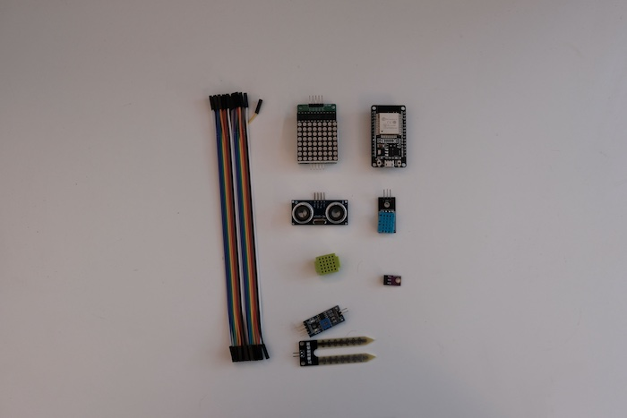
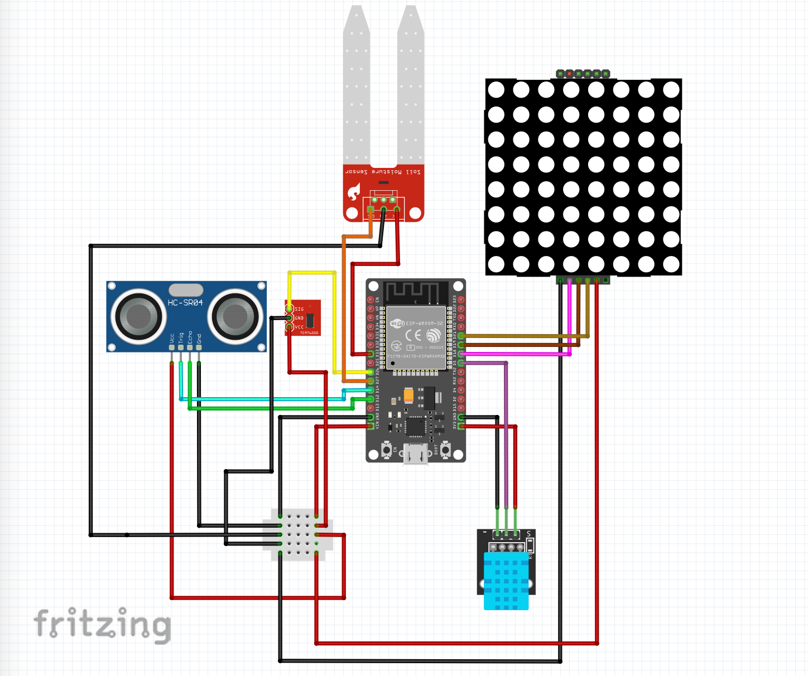
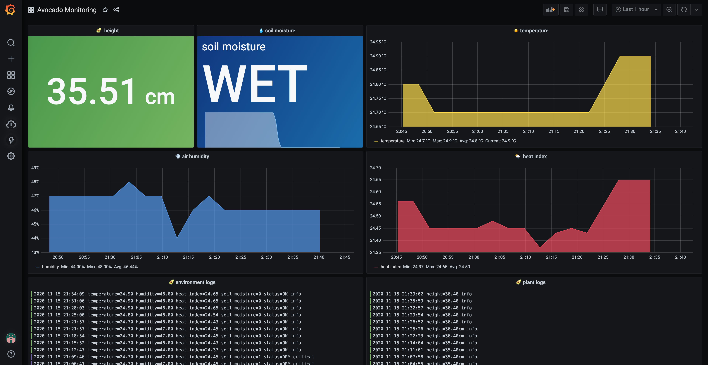

# Avocado monitoring with with Arduino and Grafana

The Avocado (or basically any plant) monitoring system helps you make more data driven decisions when it comes to taking care of your plants. It monitors your plant's height, air temperature, air humidity, light conditions and soil moisture and sends data straight to Grafana Cloud's Loki and Prometheus. You can then visualise your data in Grafana's dashboard and set up alerts that will notify you when is the best time to water your plant.

This project was part of **[GrafanaCONline 2021 Easy DIY IoT projects with Grafana](https://grafana.com/go/grafanaconline/2021/diy-iot/)** session.

## Arduino & Grafana

To start, review and follow steps in the **[Grafana DIY IoT repo](https://github.com/grafana/diy-iot)**.

## Hardware

To build this system, you will need:

- **1 [DHT11](https://components101.com/sensors/dht11-temperature-sensor)** sensor to measure temperature and humidity
- **1 [HC-SR04](https://components101.com/sensors/ultrasonic-sensor-working-pinout-datasheet)** ultrasonic distance sensor
- **1 [Soil moisture](https://components101.com/modules/soil-moisture-sensor-module)** sensor
- **1 [TEMT6000](https://learn.sparkfun.com/tutorials/temt6000-ambient-light-sensor-hookup-guide/all)** light sensor
- **1 [LED display MATRIX MAX7219](https://components101.com/displays/8x8-led-matrix-module)** LED display
- **1 [ESP32 DEVKIT DOIT](https://randomnerdtutorials.com/getting-started-with-esp32/)** development board
- **7 F-F, M-F && M-M Dupont cables**
- **1 micro USB cable**
- **1 USB charger**

Plus:
- **1 plant stand** to put this all together and build the monitoring system

## Libraries:

- **Adafruit Unified Sensor** by Adafruit
- **DHT sensor library by** Adafruit
- **HCSR04** by Martin Sosic

## Circuit & Wiring diagrams

## Data storage and visualisation

Download this repo that includes the software for room comfort monitoring. Update config.h file with your names, passwords and API keys. Upload software to your board using Arduino IDE.

